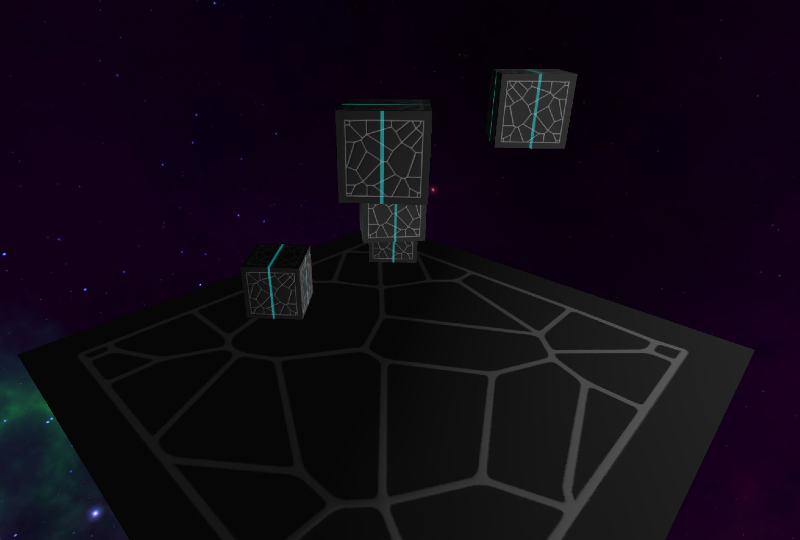

# Modern OpenGL - Deferred Rending



Modern OpenGL deferred rendering example

This little project shall contain the tools to produce the following techniques and effects:
* deferred rendering
* deferred lighting
* shadows
* bloom

## Requirements

Development is done with
* Conan 2.x
* CMake 3.27.x
* Visual Studio 2022 Community Edition

## Building

Conan install for debug and release build types
```
conan install . --build=missing --settings=build_type=Debug && conan install . --build=missing --settings=build_type=Release
```

CMake project generation
```
cmake --preset conan-default
```

For Windows development, open the solution file (.sln) located in the newly created build directory.
For Linux development, note that the build directory now should contain a Debug and Release directory which can be build via build command separately.

## Troubleshooting

In case of issues try (in no particular order)
* Removing the build directory and the CMakeUserPresets.json
* Cleaning the repository via ```git clean -xfd```
* Deleting and cloning the whole repository again
* Ensure your cmake version is at least 3.27.0
* Ensure your conan profile is generated in case of a new conan installation
* Ensure your conan is at version 2.x
* Ensure your conan profile is set to C++ standard 17 or higher